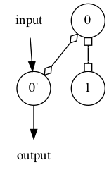

# SImBA - Systematic Inference of Bosonic quAntum systems

[](https://github.com/joebentley/simba)
[](https://pypi.org/project/quantum-simba/)
[](https://github.com/joebentley/simba/actions)
[](https://opensource.org/licenses/MIT)
[](https://simbapy.readthedocs.io/en/latest/?badge=latest)

[>>Documentation<<](https://simbapy.readthedocs.io/en/latest/)

*Compute graphical quantum system representations from transfer functions*

```python
from simba import transfer_function_to_graph, tf2rss, adiabatically_eliminate
from sympy import symbols

s = symbols('s')
gamma_f, lmbda = symbols('gamma_f lambda', real=True, positive=True)
tf = (s**2 + s * gamma_f - lmbda) / (s**2 - s * gamma_f - lmbda)

transfer_function_to_graph(tf, 'active_coupled_cavity.png', layout='dot')
```



*Calculate system transfer functions from the inferred system*

```python
split_network = tf2rss(tf).to_slh().split()
h_int = split_network.interaction_hamiltonian
h_int.expr.simplify()
```

*Compute transfer functions between any degrees of freedom of the system*

```python
print(split_network.state_vector)
tfm = split_network.tfm
tf = tfm.open_loop('a_1', 'aout_1').simplify()
gamma_1, _ = split_network.aux_coupling_constants
adiabatically_eliminate(tf, gamma_1)
```

## Installation

Install via `pip install quantum-simba`

See `notebooks` for examples.

To clone the dev environment run,

```
$ conda env create -f=environment.yml
$ conda activate simba
```

To install simba for development purposes,

```
$ pwd
... (simba code directory containing setup.py)
$ pip install -e .
(then to run test suite)
$ py.test
```

To build documentation locally,

```
$ pwd
... (simba code directory containing setup.py)
$ ./make_docs.sh
```

## Motivation

Often when designing detectors for high-precision measurements, we are most interested in the frequency domain behaviour of such systems. For example, when computing the measurement shot noise of a gravitational wave detector, the noise spectrum is determined solely by the transfer function from the internal degree of freedom perturbed by the passing gravitational wave to the measurement output of the detector.

Until recently there has been no way to infer the layout of a quantum system directly from its transfer function, but now due to recent research in the quantum control community this is possible.

This software makes the process of finding a given physical realisation from the input-output transfer function completely automatic. Once this has been computed, it can then be used, for example, to deduce physical realisations, or more interestingly, to compute the most sensitive possible detector for a given numbers of internal degrees of freedom by minimizing the quantum Cramer-Rao bound.

## TODO

* Example notebooks
* Write paper
* Implement scattering matrix
* Include examples on this page
